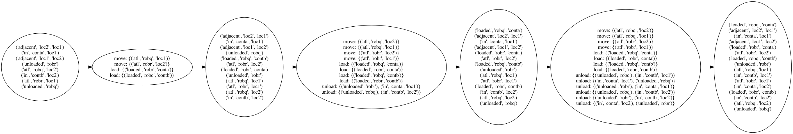

# planning-graph
Planning Graph for AI Planning in Python

## About
This library implements Planning Graph and its Planner that can be used to solve
STRIPS-like AI Planning Problems using PDDL.

When passed the domain and problem representations in PDDL, the library returns
Solution Plan if any.

## Documentation
If you are interested in understanding the Planning Graph, please read my post
at https://towardsdatascience.com/improving-classical-ai-planning-complexity-with-planning-graph-c63d47f87018

## Installation
```commandline
pip install planning-graph
```
or, you can clone this repository

## Example

### PDDL for representing planning domain and problem
The Dock-Worker Robots Domain and Problem are provided in the [domain](domain) directory.
You can create your own PDDL files, or you can download from the internet.

### Create a Planning Graph from PDDL
```python
from planning_graph.planning_graph import PlanningGraph


planning_graph = PlanningGraph('domain/dock-worker-robot-domain.pddl', 
                               'domain/dock-worker-robot-problem.pddl')

graph = planning_graph.create(max_num_of_levels=10)
```
planning_graph.create() returns a Graph object if the goal state is achieved, or 
the maximum number of levels have been reached.

### Create visualization
If you want to visualize the generated graph you can set visualize=True, by default
it is set to False.
```python
from planning_graph.planning_graph import PlanningGraph


planning_graph = PlanningGraph('domain/dock-worker-robot-domain.pddl', 
                               'domain/dock-worker-robot-problem.pddl',
                               visualize=True)

graph = planning_graph.create(max_num_of_levels=10)
graph.visualize_png("generated_graph.png")
```
the result looks like the following:


### Find a Solution Plan
To find a solution plan you simply have to create a Planner and pass the arguments
it requires.
```python
from planning_graph.planning_graph import PlanningGraph
from planning_graph.planning_graph_planner import GraphPlanner


planning_graph = PlanningGraph('domain/dock-worker-robot-domain.pddl', 
                               'domain/dock-worker-robot-problem.pddl')

graph = planning_graph.create(max_num_of_levels=10)
goal = planning_graph.goal
graph_planner = GraphPlanner()
layered_plan = graph_planner.plan(graph, goal)
```
it returns a layered plan if the solution exists, otherwise, it returns None.

## pddlpy
pddlpy included in this repo is the work of Hernán M. Foffani, it is copied from [here.](https://github.com/hfoffani/pddl-lib)
It is copied because it won't work when installed as a package due to wrong version of
antlr4 package. There are no changes made to it.
